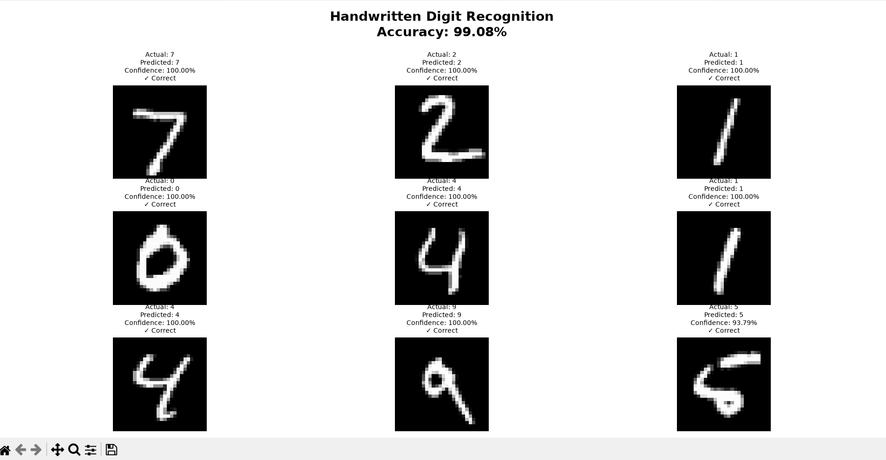
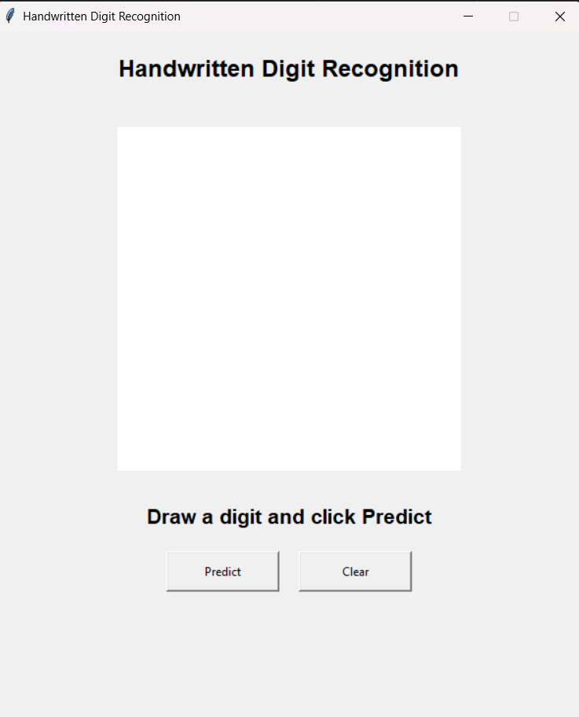
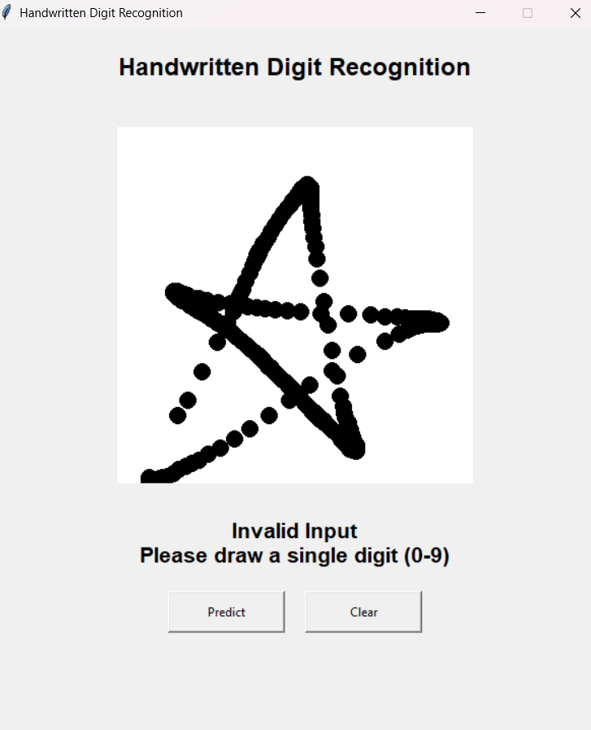
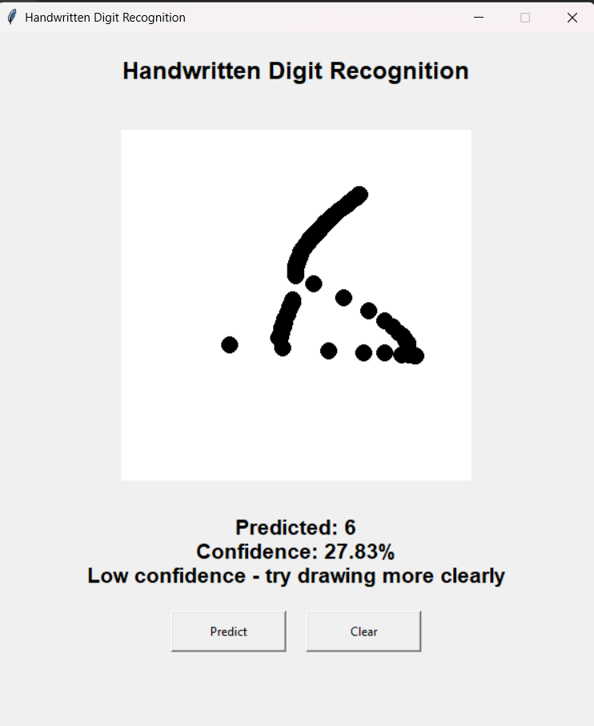
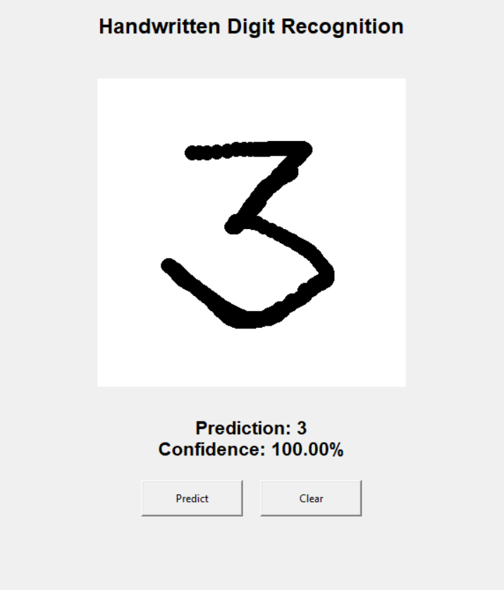

# Handwritten Digit Recognition using CNN

## Project Overview

This project is an Artificial Intelligence application that recognizes handwritten digits using a Convolutional Neural Network (CNN) trained on the MNIST dataset.

The system can:

* Train a CNN model using the MNIST dataset
* Predict digits from handwritten images
* Provide confidence scores for predictions
* Allow users to draw digits using an interactive GUI
* Detect invalid or unclear inputs
* Save and load trained models for faster execution

The model achieves approximately **99.08% test accuracy** on the MNIST dataset.

---

# Features

* CNN-based handwritten digit recognition
* Trained on the MNIST dataset
* Achieves 99.08% test accuracy
* Interactive drawing canvas using Tkinter
* Real-time digit prediction
* Confidence score display
* Invalid input detection
* Low-confidence prediction warning
* Custom image prediction support
* Model saving and loading using `.keras`
* Modular project architecture

---

# Technologies Used

### Programming Language

* Python 3.13+

### Libraries

* TensorFlow
* Keras
* NumPy
* Matplotlib
* Pillow (PIL)
* Tkinter

---

# Project Structure

```text
handwritten-digit-recognition/
│
├── main.py
├── gui.py
├── predict.py
├── digit_model.keras
│
├── screenshots/
│   ├── Gui_Dashboard.png
│   ├── Gui_Output_1.png
│   ├── Gui_Output_2.png
│   ├── Gui_Output_3.png
│   └── main_py.png
│
├── README.md
└── .gitignore
```

---

# Python Version

Recommended:

```text
Python 3.13
```

Check version:

```bash
python --version
```

---

# Create Virtual Environment

Open PowerShell inside the project folder.

Create virtual environment:

```powershell
py -3.13 -m venv .venv
```

Activate virtual environment:

```powershell
.\.venv\Scripts\activate
```

After activation:

```text
(.venv)
```

---

# Install Required Libraries

```powershell
pip install numpy matplotlib tensorflow pillow
```

Verify installation:

```powershell
python -c "import numpy, matplotlib, tensorflow, PIL; print('Libraries Installed Successfully')"
```

---

# Running the Project

## Train and Evaluate Model

```powershell
python main.py
```

This will:

1. Load the MNIST dataset
2. Train the CNN model
3. Save the trained model
4. Evaluate accuracy
5. Display sample predictions
6. Predict custom handwritten images

---

## Launch GUI Application

```powershell
python gui.py
```

The GUI allows users to:

1. Draw a digit using the mouse
2. Click Predict
3. View prediction results
4. View confidence scores
5. Clear the canvas and test again

---

# Testing with Your Own Handwritten Image

## Step 1

Open Microsoft Paint.

Press:

```text
Windows + R
```

Type:

```text
mspaint
```

Press Enter.

---

## Step 2

Use:

```text
White Background
Black Color
```

Draw a large handwritten digit.

Examples:

```text
0
1
3
5
7
8
9
```

---

## Step 3

Save image as:

```text
my_digit.png
```

Format:

```text
PNG
```

---

## Step 4

Place the image in the project folder.

Example:

```text
handwritten-digit-recognition/
│
├── main.py
├── my_digit.png
└── README.md
```

---

## Step 5

Run:

```powershell
python main.py
```

When prompted:

```text
Enter image name:
```

Type:

```text
my_digit.png
```

---

# Screenshots

## Main Model Evaluation

```markdown

```

## GUI Dashboard

```markdown

```

## Invalid Input Detection

```markdown

```

## Low Confidence Prediction

```markdown

```

## Successful Prediction

```markdown

```

---

# CNN Architecture

```text
Input Image (28 × 28)
        │
        ▼
Conv2D (32 Filters)
        │
        ▼
MaxPooling2D
        │
        ▼
Conv2D (64 Filters)
        │
        ▼
MaxPooling2D
        │
        ▼
Flatten
        │
        ▼
Dense (128 Neurons)
        │
        ▼
Dense (10 Classes)
```

---

# Results

Dataset:

```text
MNIST Handwritten Digit Dataset
```

Training Images:

```text
60,000
```

Testing Images:

```text
10,000
```

Test Accuracy:

```text
99.08%
```

---

# Virtual Environment Troubleshooting

If you see errors such as:

```text
ModuleNotFoundError: No module named 'numpy'
```

or

```text
ModuleNotFoundError: No module named 'tensorflow'
```

activate the correct environment:

```powershell
.\.venv\Scripts\activate
```

Check active Python:

```powershell
where python
```

Check installed packages:

```powershell
pip list
```

---

# Tips for Better Predictions

For best results:

* Draw digits clearly
* Keep the digit centered
* Use a white background
* Use black color for the digit
* Avoid touching image borders
* Avoid very small handwriting
* Save images in PNG format

---

# Future Enhancements

* Alphabet Recognition (A-Z)
* Multi-Digit Recognition
* Streamlit Web Application
* Real-Time Webcam Recognition
* Mobile Application Support
* Advanced Invalid Input Detection

---

# Author

**Suchendra A**

Information Science and Engineering

Cambridge Institute of Technology, Bengaluru
